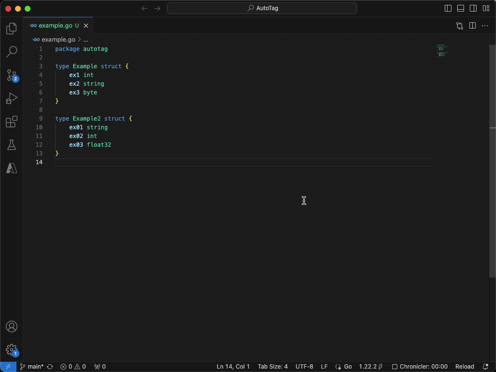

# AutoTag README

Searches through a .go file to find structs and will generate a camel case JSON tag for each
field in the struct, enables JSON marshalling on types

## Example

## Known Issues

General data flow and data organization is lacking. Too many loops are used

